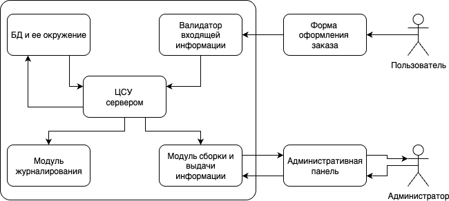

# Киберимунный магазин

**Описание работы:** студентам предлагается спроектировать и реализовать простейший онлайн магазин при помощи высокоуровневых средств разработки (Django).

Высокоуровневая архитектура итогового приложения представлена на рисунке ниже.

Описание сущностей итоговой системы
| Сущность | Описание |
|----------|----------|
| Форма офомления заказа | Простая текстовая форма в клиентском приложении (Браузере) с текстовыми полями ввода и кнопкой отправки данных на сервер |
| Валидатор входящей информации | Выполняет функции проверки на корректность входящей информации от пользователя |
| ЦСУ сервером | Центральный модуль сервера, осуществляющий контроль за выполнением всех операций на сервере |
| БД и ее окружение | БД, хранящая данные в зашифрованном виде + подмодули, обеспечивающие защиту информации на сервере |
| Модуль журналирования | Обеспечивает фиксацию всех происходящих событий на сервере |
| Модуль сборки и выдачи информации | обеспечивает прием команд от администратора, а также выдачу/редактирование информации из БД, а также получение журнала событий |
| Административная панель | Особая версия клиентского приложения для предоставления административных функций продукта |

Итоговое приложение должно предоставлять пользователю и администратору следующие функциональные воможности:
1. Получение и сохранение в БД данных пользовательского заказа.
2. Осуществление процесса резервного копирования БД с определенной периодичностью.
3. CRUD функционал для администратора без нарушения защищенности БД + добавление функции проверки чексуммы файла БД при выдаче администратору.
4. Выдача собранной информации о произошедших событиях администратору (выдача лога событий по требованию) + обеспечение защищенности журнала (шифрование).

## Задание на самостоятельную работу:
1. Дополнить архитектуру приложения по своему усмотрению для обеспечения киберимунности продукта.
2. Составить схему логического взаимодействия модулей приложения.
3. Используя заготовленную версию Django-сервера (директория django-test в корневой директории лабораторной работы; там же есть файл с зависимостями проекта - requirements.txt) реализовать все функции, указанные выше.

## Возможные варианты реализации отдельных функций:
1. Общение ЦСУ с БД лучше реализовать при помощи встроенной ORM с надстройками для обеспечения наибольшей зищищенности.
2. При реализации функции чексумм для администратора лучше использовать следующую схему взаимодейтсвия: отправка клиентом запроса на получение данных с БД => отправка сервером рассчитанной чексуммы БД на клиент => отправка клиентом повторного запроса на получение данных с БД (с флагом полученной чексуммы) => отравка серером данных с БД => проверка сохраненной чексуммы с чексуммой, рассчитанной на основе полученных данных.
3. Валидатор входящей информации должен проверять только структуру входящих данных, проверку на деструктивные воздействия (например, SQL-инъекцию должно проверять окружение БД).